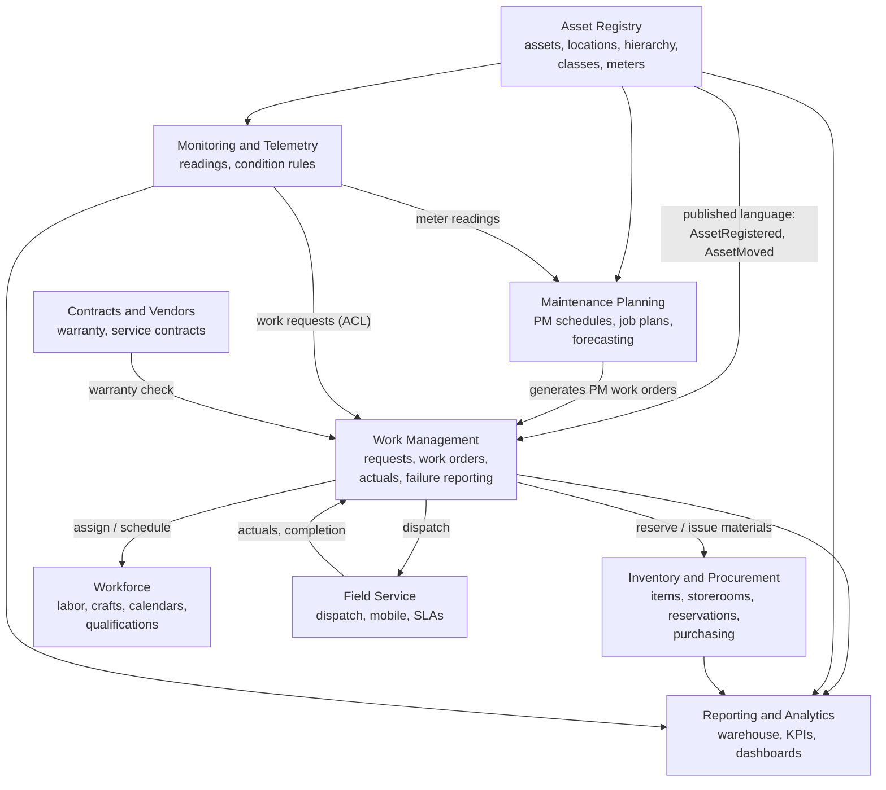

# Bounded Contexts and Service Boundaries

EAM is large enough that one model for everything fails: "asset" in the registry (serial number, attributes,
hierarchy) is not the same concept as "asset" in reporting (a dimension row with historical criticality) or in
monitoring (a stream of telemetry). Domain-driven design's **bounded contexts** keep each model coherent.

## Context map

## Context responsibilities

| Context | Owns | Key invariants | Integration |
|---|---|---|---|
| **Asset Registry** | Assets, locations, hierarchy, classes, specifications, meters | Unique asset number per site; hierarchy is acyclic; moves keep history | Publishes `AssetRegistered`, `AssetMoved`, `AssetStatusChanged` |
| **Work Management** | Work requests, work orders, status history, actuals, failure reports | Lifecycle rules ([work order lifecycle](04-work-order-lifecycle.md)); closed WOs immutable | Consumes PM generation and condition work requests; publishes `WorkOrderStatusChanged`, `WorkOrderCompleted` |
| **Maintenance Planning** | PM schedules, job plans, routes, forecasts | One work order per PM occurrence | Consumes meter readings and completions; issues `GenerateWorkOrder` commands |
| **Inventory & Procurement** | Items, storerooms, balances, reservations, purchase requisitions | Balances never negative; average cost maintained on receipt | Consumes reservations/issues from WM; publishes `ReorderPointReached` |
| **Workforce** | Labor, crafts, rates, shifts, qualifications | Technicians assigned only to work matching their craft and certifications | Provides availability to scheduling |
| **Field Service** | Dispatch, routes, mobile sync, customer SLAs | A job is owned by one technician at a time; offline edits reconciled | Bi-directional with WM ([field service](11-field-service.md)) |
| **Monitoring & Telemetry** | Telemetry streams, condition rules, alarms | No duplicate work requests per condition episode | Anti-corruption layer translates alarms into work requests ([telemetry](10-telemetry-integration.md)) |
| **Contracts & Vendors** | Vendors, contracts, warranty terms | Contract dates valid; asset coverage explicit | Answers "is this asset under warranty?" |
| **Reporting & Analytics** | Warehouse, star schema, KPIs | Facts reconcile to source totals | Fed by CDC / events ([reporting](09-reporting-architecture.md)) |

## Relationship patterns used

- **Customer–supplier:** Maintenance Planning (supplier) generates work for Work Management (customer).
- **Published language:** domain events with versioned schemas ([event architecture](08-event-architecture.md)).
- **Anti-corruption layer:** telemetry alarms are translated into Work Management's own *work request* concept; the
  monitoring vocabulary (tags, signals, alarm classes) never leaks into work orders.
- **Shared kernel (small):** asset identifiers and site codes.

## Service boundaries

A context is a candidate service, not an obligation. A pragmatic split for an EAM product:

| Deployable | Contexts | Why together / apart |
|---|---|---|
| `asset-service` | Asset Registry, Contracts | Read-heavy, low write rate, referenced by everything |
| `work-service` | Work Management, Maintenance Planning | Highly cohesive; PM generation writes work orders transactionally |
| `inventory-service` | Inventory & Procurement | Separate consistency needs (stock balances), separate team in many organisations |
| `workforce-service` | Workforce | Integrates with HR systems |
| `field-service` | Field Service + mobile sync | Different scaling (mobile clients), offline concerns |
| `monitoring-platform` | Monitoring & Telemetry | Orders of magnitude more write volume — see [realtime-monitoring-platform](https://github.com/shivkumarsinghsky/realtime-monitoring-platform) |
| `reporting` | Reporting & Analytics | Different storage and query patterns |

See [ADR-001](decisions/ADR-001-bounded-contexts-as-service-boundaries.md).

Next: [Asset Lifecycle](03-asset-lifecycle.md)
