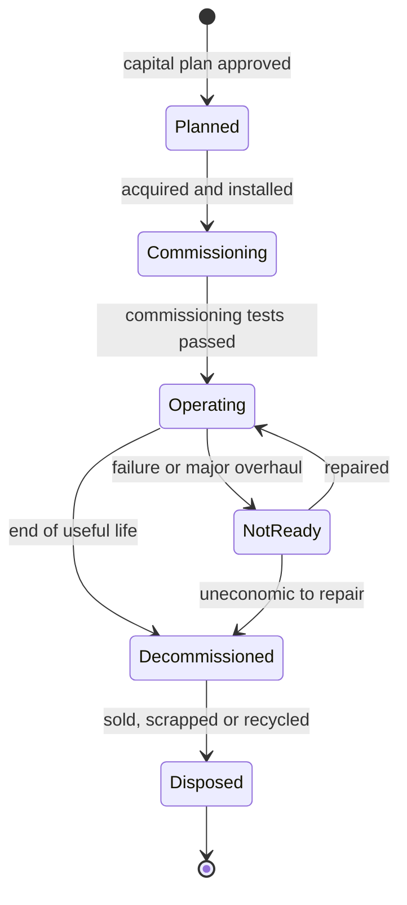
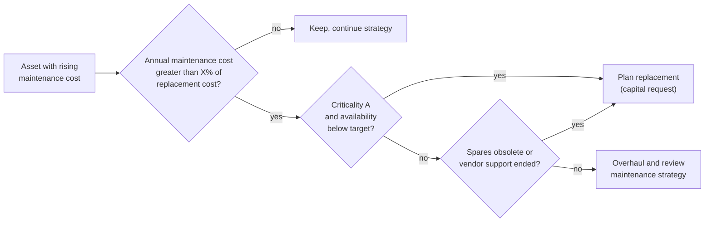

# Asset Lifecycle

An asset's life spans planning to disposal; EAM software is involved at every stage, although most of the data
volume comes from the *operate and maintain* stage.

| Stage | Typical EAM activities | Data captured |
|---|---|---|
| **Plan** | Needs analysis, lifecycle cost (TCO) comparison, capital budgeting | Requirements, budget, expected life |
| **Acquire** | Purchase, receipt, warranty registration | Vendor, cost, serial number, warranty terms |
| **Install / commission** | Installation work orders, inspection, as-built documentation | Install date, location, specifications, baseline readings |
| **Operate & maintain** | PM, inspections, condition monitoring, corrective work | Work history, meter readings, failures, costs, downtime |
| **Overhaul / renew** | Major refurbishment, component replacement | Capitalised cost, extended life |
| **Decommission** | Isolation, removal, data archiving | Final status, reason |
| **Dispose** | Sale, scrap, environmental compliance | Disposal value, certificates |

## Design implications

- **Lifecycle status is not maintenance status.** An asset can be `OPERATING` while having open work orders.
  `lifecycle_status` lives in the asset registry; work state lives on work orders.
- **History must survive moves and replacements.** Functional locations keep the process position's history;
  the asset keeps its own history when moved to another position (`AssetMoved` event, hierarchy history).
- **Decommissioning is a soft state.** Decommissioned and disposed assets are never deleted: they anchor cost and
  failure history used for reliability analysis of similar assets.
- **Lifecycle cost** = acquisition + installation + Σ(maintenance labor, materials, services) + downtime cost +
  disposal − residual value. The reporting model keeps acquisition and maintenance costs in the same asset
  dimension so repair-vs-replace decisions can be made from data.

## Repair vs. replace (decision support)

Thresholds are organisation-specific; the point is that the data model must make maintenance cost, criticality,
availability and replacement cost available per asset — see [reporting](09-reporting-architecture.md).

Next: [Work Order Lifecycle](04-work-order-lifecycle.md)
