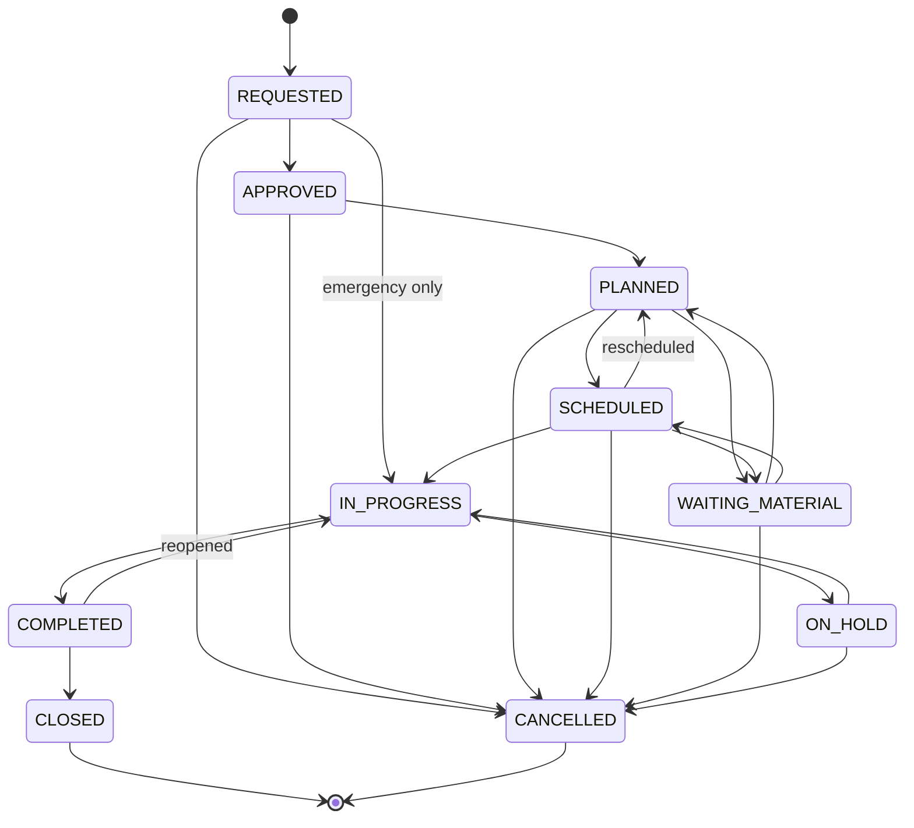
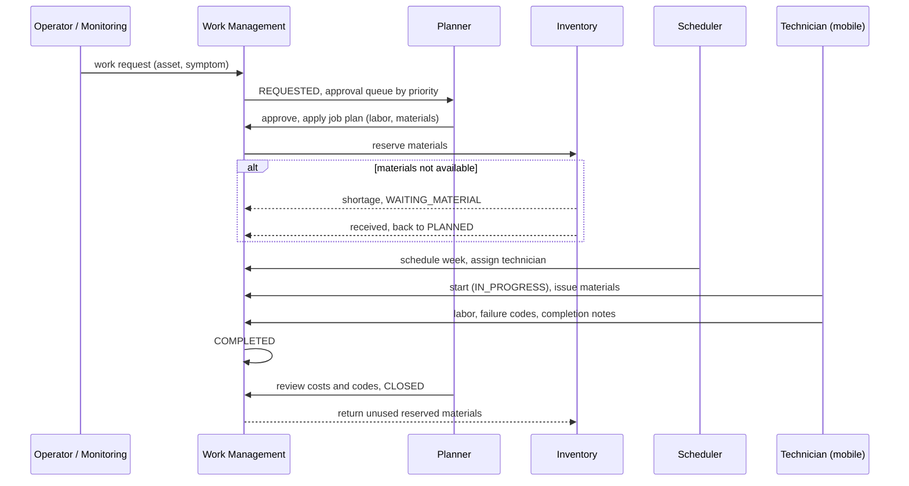

# Work Order Lifecycle

The work order is the central transaction in EAM. Its lifecycle encodes how an organisation authorises, plans,
executes and learns from maintenance work. The reference implementation is
[`src/eam/work_orders.py`](../src/eam/work_orders.py) with tests in
[`tests/test_work_orders.py`](../tests/test_work_orders.py).

## State machine

## Guards (business rules)

| Transition | Rule | Why |
|---|---|---|
| → `IN_PROGRESS` | A technician must be assigned | Accountability, labor capture, safety (who is on site) |
| → `COMPLETED` | Labor actuals recorded | Cost and backlog accuracy |
| → `COMPLETED` (CM/EM) | Failure report (problem/cause/remedy) present | Without it, reliability analysis is impossible |
| `REQUESTED` → `IN_PROGRESS` | Only for emergency work | Emergencies skip approval/planning; reviewed afterwards |
| `CLOSED`, `CANCELLED` | Terminal and immutable | Closed WOs feed cost and reliability history; corrections are new transactions |
| `COMPLETED` → `IN_PROGRESS` | Reopen allowed until closed | A repair that did not hold is the same job, not a new failure |

The SQL schema backs the most important guard with a constraint: corrective/emergency work orders cannot be
`COMPLETED`/`CLOSED` without a problem code.

## End-to-end sequence (corrective work)

## Priority

Priority is typically derived, not chosen freely: **priority = f(asset criticality, consequence/urgency of the
reported condition)**, for example a matrix where an A-critical asset with a safety-relevant symptom yields P1.
Deriving it keeps the backlog honest — when everything is P1, nothing is.

## Events emitted

`WorkOrderCreated`, `WorkOrderStatusChanged` (from, to, by, at), `MaterialIssued`, `LaborReported`,
`WorkOrderCompleted` (with failure codes and downtime), `WorkOrderClosed` (final cost). See
[event architecture](08-event-architecture.md).

Next: [Maintenance Strategies](05-maintenance-strategies.md)
