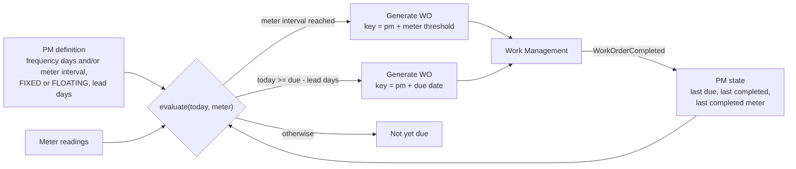
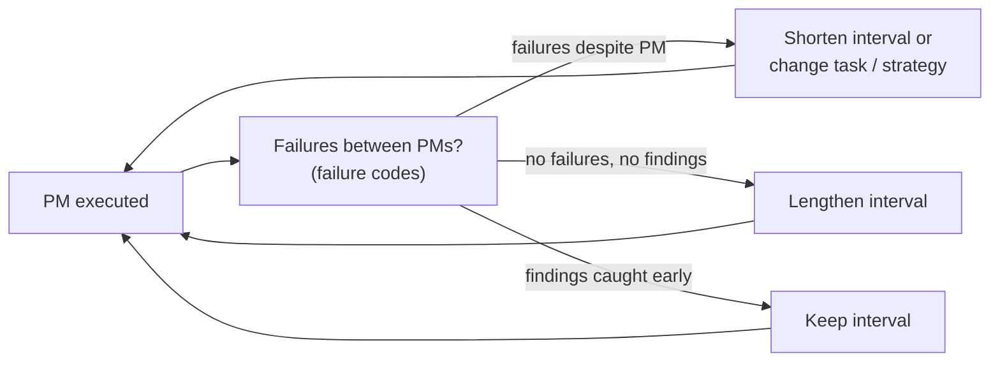

# Maintenance Strategies and PM Scheduling

## Strategy spectrum

| Strategy | Trigger | Best for | Cost profile |
|---|---|---|---|
| **Reactive (run-to-failure)** | Failure | Cheap, non-critical, redundant assets (light bulbs, standby equipment with spares) | Low planning cost, high failure cost |
| **Preventive — time-based** | Calendar interval | Age-related wear, statutory inspections (pressure vessels, fire systems) | Predictable; may replace parts early |
| **Preventive — usage-based** | Meter interval (hours, cycles, km) | Wear driven by use (engines, compressors, vehicles) | Matches wear better than time |
| **Condition-based (CBM)** | Measured condition crosses a threshold | Assets with measurable degradation (vibration, temperature, oil analysis) | Needs sensors/inspections; avoids unnecessary work |
| **Predictive (PdM)** | Model predicts remaining useful life | High-value, high-criticality assets with rich data | Highest data/analytics investment |
| **Reliability-centred (RCM)** | Analysis per failure mode | Choosing *which* of the above per asset/failure mode | Analysis effort up front |

Criticality drives the choice: A-critical assets justify CBM/PdM; C assets are often run-to-failure.

## PM scheduling model

Implemented in [`src/eam/pm.py`](../src/eam/pm.py).

### Fixed vs. floating

| | Fixed | Floating |
|---|---|---|
| Next due date | `last due + frequency` | `last completion + frequency` |
| Late completion | Next due date unchanged → intervals between jobs shrink | Next due date moves later |
| Use when | Calendar compliance matters (statutory, contractual) | Wear accumulates from the last service |

### "Whichever comes first"

A PM can combine time and meter triggers (e.g. every 500 running hours or yearly). The meter trigger wins when the
usage interval is reached before the calendar date.

### Idempotent generation

The scheduler runs repeatedly (nightly batch, or on each meter reading). Work orders are keyed by
`(pm_id, due date)` — or `(pm_id, meter threshold)` for usage triggers — and the database enforces uniqueness
(`work_orders_pm_occurrence` index), so re-running the scheduler never duplicates work.

### Forecasting

Projecting due dates for the next 12 months (assuming on-time completion) feeds labor and material planning and
budgeting: `forecast(pm, state, count)`.

## PM optimisation loop

PM compliance, MTBF by failure mode and PM findings (inspection results) are the inputs; they come from the
[reporting model](09-reporting-architecture.md).

Next: [Service Boundaries and API Design](06-service-boundaries-and-api.md)
