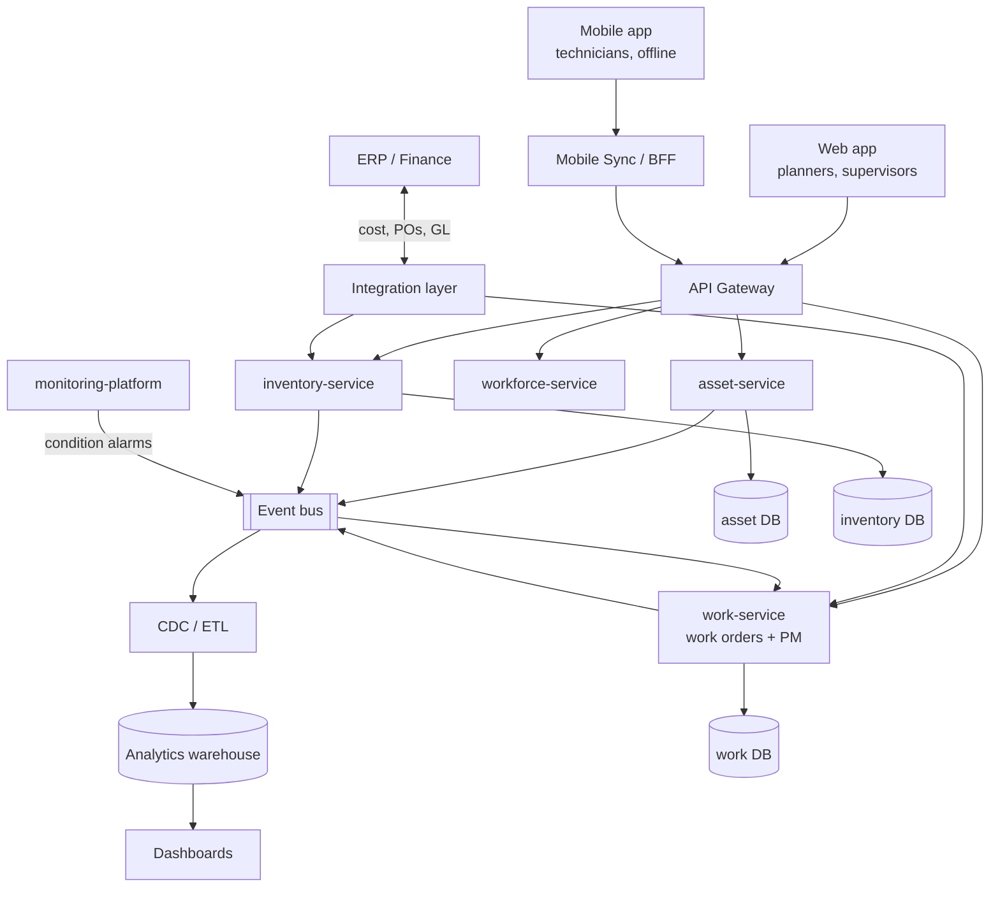

# Service Boundaries and API Design

## Logical architecture



## API style

The reference contract is [`docs/api/openapi.yaml`](api/openapi.yaml) (OpenAPI 3.1, validated in CI).

| Concern | Choice | Reason |
|---|---|---|
| Resources | `/assets`, `/work-orders`, `/pm-schedules`, `/meters/{id}/readings` | Map to aggregates of each context |
| Lifecycle changes | `POST /work-orders/{id}/transitions { "to": "SCHEDULED" }` | Status is not a field to PATCH; the server applies lifecycle guards and returns 409 on violations |
| Concurrency | `ETag` + `If-Match` on mutable resources | Planners and technicians edit the same work order; lost updates are common without it |
| Creates | `Idempotency-Key` header | Mobile clients on poor networks retry |
| Pagination | Cursor (`nextCursor`) | Stable under concurrent inserts, unlike offsets |
| Hierarchy queries | `GET /assets?under=SITE01.BOILER` | Maps to an indexed `ltree` prefix query |
| Errors | RFC 9457 problem details with `correlationId` | Consistent, machine-readable |
| Bulk telemetry | `POST /meters/{id}/readings` accepts batches, returns 202 | Readings feed PM evaluation asynchronously |

## Example interactions

```http
POST /api/v1/work-orders
Idempotency-Key: 6f0c2a1e-req-0001
{ "assetId": "P101", "workType": "CM", "description": "Seal leak at drive end", "priority": 2 }
→ 201 { "id": "wo_8812", "woNum": "WO-1001", "status": "REQUESTED", ... }

POST /api/v1/work-orders/wo_8812/transitions
If-Match: "v3"
{ "to": "COMPLETED" }
→ 409 { "type": ".../lifecycle-violation", "detail": "corrective work requires a failure report (problem/cause/remedy)" }

GET /api/v1/assets?under=SITE01.BOILER.FW&criticality=A
```

## Integration with ERP

Most EAM deployments coexist with an ERP: purchase orders, invoices, GL postings and fixed-asset accounting live
there. The integration layer exchanges **cost postings** (closed work order actuals → GL), **purchase requisitions**
(inventory reorders → ERP POs), **receipts** (ERP → inventory balances) and **asset master data** (capitalised
assets). Each exchange is asynchronous, idempotent and reconciled daily.

Next: [Database Design](07-database-design.md)
