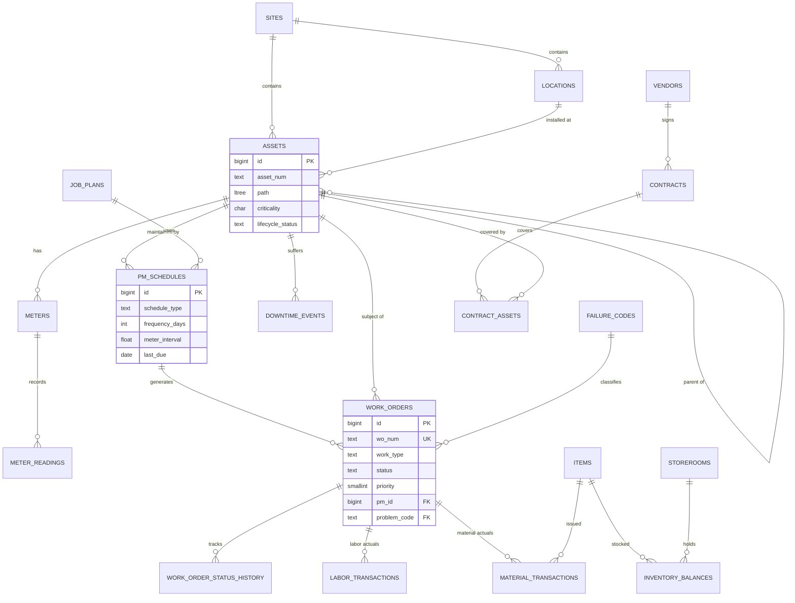

# Database Design

The reference operational schema is [`sql/01_schema.sql`](../sql/01_schema.sql) (PostgreSQL), with sample data
in [`sql/02_seed.sql`](../sql/02_seed.sql) and KPI views in
[`sql/03_operational_views.sql`](../sql/03_operational_views.sql). All of it is executed by the test suite.

## Core entity relationships

## Key design decisions

### Asset hierarchy: materialised path with `ltree`

| Option | "All descendants" query | Move a subtree | Notes |
|---|---|---|---|
| Adjacency list (`parent_id`) | Recursive CTE | Update one row | Simple; recursive queries on every roll-up |
| Closure table | Single join | Rewrite many closure rows | Fast reads; heavy writes |
| Nested sets | Range query | Renumber large parts of the tree | Poor for frequent changes |
| **Materialised path (`ltree`)** | `path <@ 'SITE01.BOILER'` with a GiST index | Update paths of the moved subtree | Fast reads, readable paths, moderate write cost |

Assets keep `parent_asset_id` (the authoritative relationship) **and** `path` (derived, indexed). Hierarchy
changes are rare compared with roll-up queries. See [ADR-002](decisions/ADR-002-asset-hierarchy-materialised-path.md).

### Locations separate from assets

A functional location's history ("this pump position failed 6 times") survives replacing the physical pump; the
pump's own history follows it to its next location.

### Constraints carry business rules

- `work_orders_pm_occurrence` unique index → idempotent PM generation.
- `CHECK` that corrective/emergency work cannot be completed or closed without a problem code.
- `CHECK (reserved <= on_hand)`-style constraints on inventory balances; non-negative stock.
- Generated columns for line costs (`hours * rate`), so cost cannot drift from its inputs.

### Status history as its own table

`work_order_status_history` records every transition (who, when, note). It is the basis for response-time and
schedule-compliance metrics and for audits.

### Downtime separate from work orders

One outage can involve several work orders, and planned downtime (PM) must be distinguishable from failures for
availability and MTBF.

### Scaling notes

- `meter_readings` grows fastest: partition by month; keep raw high-frequency telemetry in the monitoring platform's
  time-series store and only summarised readings here.
- Partial index on open work orders (`WHERE status NOT IN ('CLOSED','CANCELLED')`) keeps backlog queries fast as
  history grows.
- Multi-site/multi-tenant deployments add `org_id`/`tenant_id` and row-level security — see
  [enterprise-saas-plateform](https://github.com/shivkumarsinghsky/enterprise-saas-plateform).

Next: [Event Architecture](08-event-architecture.md)
