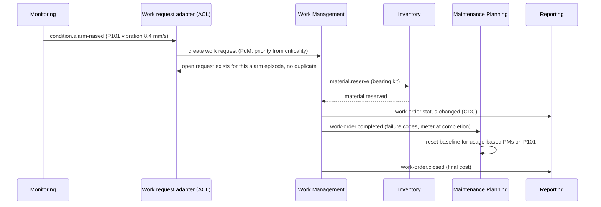

# Event Architecture

Contexts integrate through domain events published with a transactional outbox (see
[event-driven-platform](https://github.com/shivkumarsinghsky/event-driven-platform) for a runnable
implementation of the messaging mechanics).

## Event catalogue

| Event | Producer | Typical consumers |
|---|---|---|
| `asset.registered.v1`, `asset.moved.v1`, `asset.status-changed.v1` | Asset Registry | Work, Planning, Monitoring, Reporting |
| `work-order.created.v1` | Work Management | Field Service (dispatch), Reporting |
| `work-order.status-changed.v1` | Work Management | Field Service, Notifications, Reporting |
| `work-order.completed.v1` (failure codes, downtime, actual hours) | Work Management | Planning (update PM state), Reliability analytics |
| `work-order.closed.v1` (final cost) | Work Management | ERP integration (GL posting), Reporting |
| `material.reserved.v1`, `material.issued.v1` | Inventory | Work Management (availability), Reporting |
| `inventory.reorder-point-reached.v1` | Inventory | Procurement / ERP |
| `meter.reading-recorded.v1` | Monitoring / Asset Registry | Planning (meter-based PM) |
| `condition.alarm-raised.v1`, `condition.alarm-cleared.v1` | Monitoring | Work Management (via ACL) |

## Flow: condition alarm to completed work and updated PM

## Design rules

- **Events carry facts, not commands.** `work-order.completed` says what happened; Planning decides what that means
  for its PM state.
- **Correlation:** an alarm episode id flows from monitoring through the work request into the work order, so the
  whole chain is traceable and duplicates can be detected.
- **Idempotent consumers:** every consumer deduplicates by event id; state transitions are naturally idempotent
  (a completed PM occurrence cannot be completed twice).
- **Ordering per aggregate:** partition/route by `workOrderId` or `assetId`; consumers do not assume global order.
- **Versioning:** additive changes keep the version; breaking changes publish `.v2` with consumer upcasting.

Next: [Reporting Architecture](09-reporting-architecture.md)
