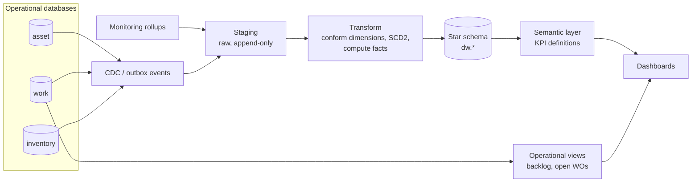
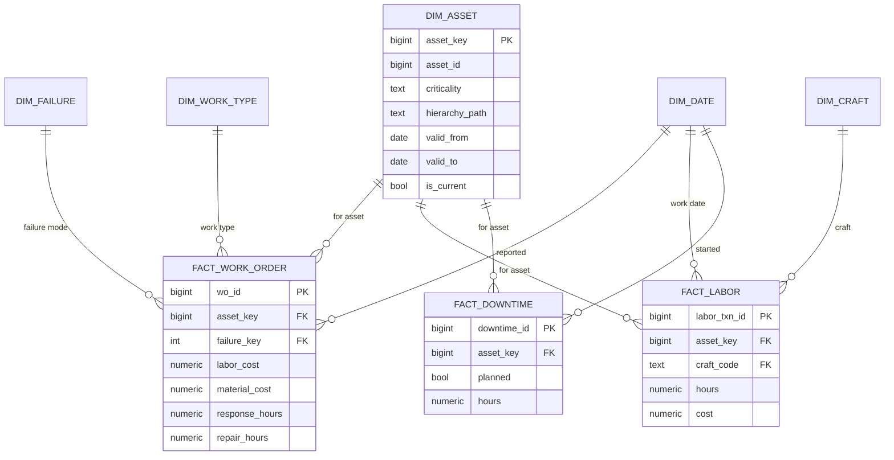

# Reporting Architecture

Maintenance reporting asks questions across years of history and many dimensions — "maintenance cost per
A-critical pump per site, planned vs. unplanned, last 3 years" — that operational schemas answer badly. The
reference design separates **operational KPIs** (live, small, from OLTP views) from **analytics** (historical,
dimensional, from a warehouse).

## Star schema

Implemented in [`sql/04_reporting_star_schema.sql`](../sql/04_reporting_star_schema.sql), loaded by
[`sql/05_load_dw.sql`](../sql/05_load_dw.sql), queried by
[`sql/06_analytics_queries.sql`](../sql/06_analytics_queries.sql).

| Table | Grain | Type |
|---|---|---|
| `fact_work_order` | One row per work order | Accumulating snapshot (milestones filled as the WO progresses) |
| `fact_labor` | One row per labor transaction | Transaction fact |
| `fact_downtime` | One row per downtime event | Transaction fact |
| `dim_asset` | One row per asset **version** | SCD type 2 — history of criticality, location, hierarchy |
| `dim_failure` | Problem/cause/remedy combination | Junk-style dimension |
| `dim_date`, `dim_work_type`, `dim_craft` | Conformed dimensions | — |

**Why SCD2 on assets:** if a pump is re-rated from C to A criticality in June, costs before June must still be
reported under C; otherwise trend charts silently rewrite history.

## KPI catalogue

| KPI | Source | Query / function |
|---|---|---|
| MTTR, MTBF, availability | `downtime_events` / `fact_downtime` | `asset_reliability()`, `mttr_by_criticality` |
| PM compliance | PM work orders vs. due dates | `v_pm_compliance_monthly` |
| Planned maintenance % | Labor hours by work type | `planned_maintenance_percentage` |
| Maintenance cost roll-up | Labor + materials up the hierarchy | `v_asset_cost_rollup` |
| Top failure modes | Failure codes + downtime | `top_failure_modes` |
| Backlog (crew-weeks) | Open approved work estimates / craft capacity | `v_backlog`, `kpis.backlog_weeks` |
| Stock-outs risk | Balances vs. reorder points | `v_reorder_required` |

Defining KPIs once (here, in versioned SQL and Python with tests) avoids the common failure where every dashboard
computes MTBF differently. See [ADR-004](decisions/ADR-004-star-schema-reporting.md).

Next: [Telemetry Integration](10-telemetry-integration.md)
