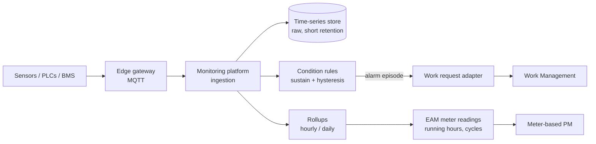
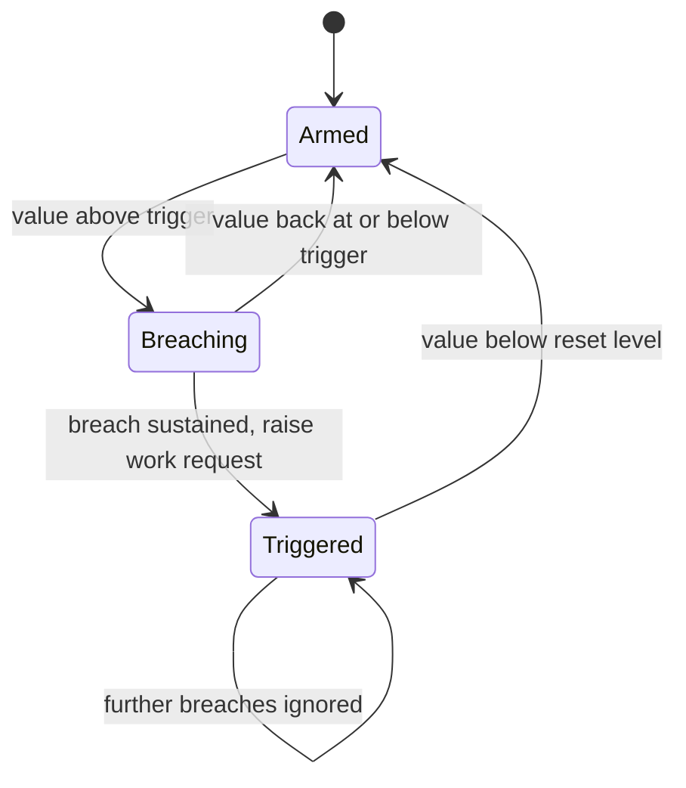

# Real-Time Telemetry Integration

Connecting EAM to live asset data turns maintenance from calendar-driven to condition-driven. The challenge is
volume and noise: telemetry arrives at thousands of readings per second, while a maintenance planner can handle a
few dozen new work requests a day.

## Architecture

The monitoring side is implemented in
[realtime-monitoring-platform](https://github.com/shivkumarsinghsky/realtime-monitoring-platform); this repository
models the EAM side.

## Volume reduction at each stage

| Stage | Volume | What it keeps |
|---|---|---|
| Raw telemetry | e.g. 1 reading / 10 s / signal | Everything, short retention (days–weeks) |
| Rollups | 1 / hour / signal | Min, max, avg, last — long retention |
| Meter readings in EAM | 1 / day / meter, or on PM evaluation | Usage counters for meter-based PM |
| Condition alarms | Per episode | Only state changes (raised / cleared) |
| Work requests | Per episode, deduplicated | Actionable work |

## Condition rules

Implemented in [`src/eam/condition.py`](../src/eam/condition.py):

- **Sustain:** the value must exceed the threshold for a minimum duration (filters spikes).
- **Hysteresis:** re-arm only after the value drops below a lower reset level (avoids flapping around the threshold).
- **One open request per episode:** further breaches while triggered do not create more requests.

## Mapping telemetry to assets

Telemetry identifies **tags/signals** (`PLANT1/FW/P101/VIB_DE`), EAM identifies **assets** (`P101`) and **meters**.
A mapping table (signal → asset, meter, unit, scaling) lives in the anti-corruption layer; neither side adopts the
other's identifiers. Asset moves (`asset.moved`) update the mapping.

## Failure modes to handle

| Failure | Mitigation |
|---|---|
| Sensor dropout | "Stale data" alarm separate from condition alarms; never interpret missing data as healthy |
| Clock skew at the edge | Gateway timestamps + server receive time; reject readings far in the future |
| Duplicate readings after reconnect | Idempotent by (signal, timestamp) |
| Alarm storm (plant trip) | Rate-limit work request creation per site; group by parent system |
| Meter reset / rollover | Detect decreases on continuous meters; record a reset rather than negative usage |

Next: [Field Service](11-field-service.md)
