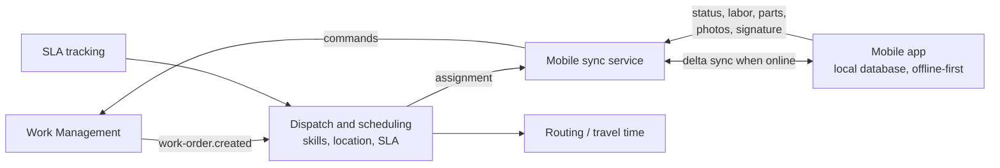
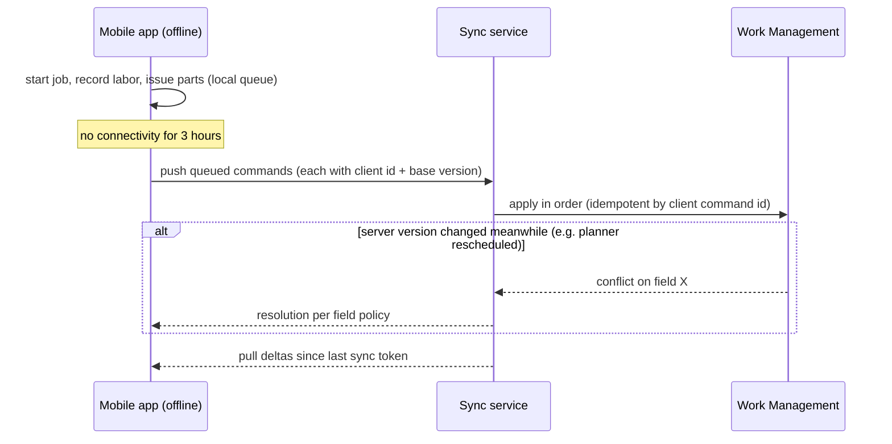

# Field Service Management

Field Service extends work management to technicians working away from a fixed plant — utilities, facilities,
telecom, equipment service providers. The defining constraints are **unreliable connectivity**, **travel time**
and **customer commitments (SLAs)**.

## Architecture

## Dispatch

Assignment optimises across: required **skills/certifications**, **location** and travel time, **SLA deadline**,
**priority**, technician **shift/calendar** and **parts** on the van. A practical approach is a scoring function
(greedy assignment) for real-time dispatch, with a batch optimiser for next-day planning.

## Offline-first mobile synchronisation

| Design point | Choice |
|---|---|
| Unit of sync | **Commands** (start, record labor, complete) rather than whole-record overwrites |
| Idempotency | Client-generated command ids; server dedupes |
| Conflicts | Field-level policy: technician wins for actuals and notes; planner wins for schedule/assignment; status transitions re-validated by the lifecycle |
| Data scope | Only the technician's assigned work, related assets and job plans — bounded local storage |
| Attachments | Uploaded separately (resumable), referenced by id |

See [ADR-006](decisions/ADR-006-offline-first-field-sync.md).

## SLAs

SLA clocks (response, restore, resolve) start from the work request and pause in defined states (e.g. waiting for
customer). Status history timestamps make SLA compliance computable after the fact — another reason the status
history table exists.

Back to: [README](../README.md)
